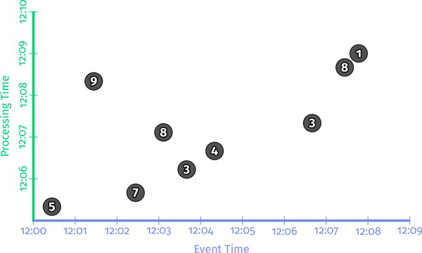
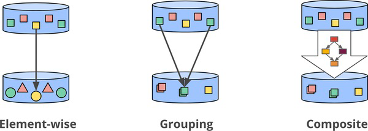
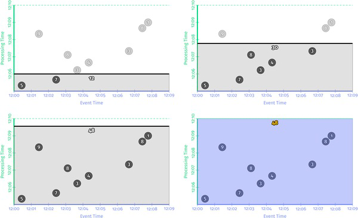
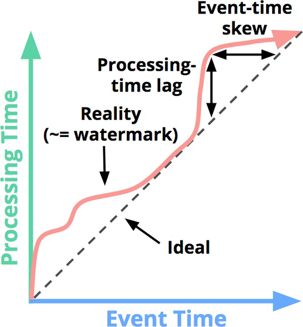

# 第二章 The What, Where, When, and How of Data Processing

1. 本章聚焦于第1章提到的数据处理模式，通过具体示例深入讨论这些模式。
2. 通过使用 Apache Beam 代码片段和时间轴图表，提供数据处理概念的视觉表示。
3. Apache Beam 是一个统一的批处理和流处理编程模型，具有多种语言的具体 SDK（如 Java 和 Python）。
4. 作者选择使用 Apache Beam 作为示例，因为它最全面地体现了本书中描述的概念。
5. 尽管作者通过 Apache Beam 的视角进行阐述，但本书的概念同样适用于其他大多数数据处理系统。
6. 作者强调过去仅有 Google Cloud Dataflow 提供足够表达力的系统，但现在大多数主要系统都在朝着类似于本书描述的模型方向发展。

## 路线图

上一章介绍了两个重要概念：

1. 事件时间和处理时间的区别
2. 窗口化

这一章还有三个重要概念，共5个：

1. **触发器**：触发器是一种机制，用于声明窗口输出相对于某个外部信号何时应该被实体化/持久化。
2. **水印**：相对于事件时间的输入完整性的概念。
3. **累积**：累积模式指定对同一窗口观察到的多个结果之间的关系。

四个问题，对于我们理解无界数据处理至关重要：

* **What 计算了哪些结果？** 这个问题由管道内的转换类型回答。这包括计算总和、构建直方图、训练机器学习模型等。实质上，这也是经典批处理所回答的问题。

* **Where 在事件时间中的哪个时刻计算结果？** 这个问题通过管道内的事件时间窗口化来回答。这包括第一章中窗口化的常见例子（固定、滑动和会话窗口）；那些似乎没有窗口概念的用例（例如，与时间无关的处理；经典批处理通常也属于这一类）；以及其他更复杂的窗口类型，例如有时间限制的拍卖。还请注意，如果您在记录到达系统时将入口时间指定为事件时间，这也可以包括处理时间窗口。

* **When 在处理时间中的哪个时刻实现结果？** 这个问题通过触发器和（可选地）水印的使用来回答。对这个主题有无数的变体，但最常见的模式是涉及重复更新的那些（即，物化视图语义），利用水印在相应输入被认为是完整的后，每个窗口仅提供一次输出的那些（即，经典批处理语义应用于每个窗口），或者两者的某种组合。

* **How 结果的精炼如何关联？** 这个问题由使用的累积类型回答：抛弃（其中结果都是独立且不同的）、累积（其中后续结果建立在先前结果之上）、以及累积和撤回（其中发出先前触发的值的累积值以及撤回）。

## 批处理的基础：What 和 Where

### What：转换

以下面的数据为例，构建流水线计算团队得分：

| Name  | Team  | Score | EventTime | ProcTime |
|-------|-------|-------|-----------|----------|
| Julie | TeamX | 5     | 12:00:26  | 12:05:19 |
| Frank | TeamX | 9     | 12:01:26  | 12:08:19 |
| Ed    | TeamX | 7     | 12:02:26  | 12:05:39 |
| Julie | TeamX | 8     | 12:03:06  | 12:07:06 |
| Amy   | TeamX | 3     | 12:03:39  | 12:06:13 |
| Fred  | TeamX | 4     | 12:04:19  | 12:06:39 |
| Naomi | TeamX | 3     | 12:06:39  | 12:07:19 |
| Becky | TeamX | 8     | 12:07:26  | 12:08:39 |
| Naomi | TeamX | 1     | 12:07:46  | 12:09:00 |

要关心的只有三个字段：

* **Score（得分）**：与此事件相关联的个体用户得分
* **EventTime（事件时间）**：得分的事件时间；即，得分发生的时间
* **ProcTime（处理时间）**：得分的处理时间；即，得分被管道观察到的时间

> 图2-1. 九个输入的记录，在事件时间和处理时间上的分布

Beam 的两个基本原语：

* **PCollections（并行集合）**：这些代表数据集（可能是庞大的数据集），可以在其上执行并行转换（因此名称开头有“P”）。
* **PTransforms（并行转换）**：这些应用于PCollections以创建新的PCollections。PTransforms可以执行逐元素的转换，它们可以将多个元素组合/聚合在一起，或者它们可以是其他PTransforms的复合组合，如图2-2所示。

> 图2-2. 转换的多种类型（分别是逐元素、分组、组合）

> 图2-3.经典的批处理

要处理无界数据批处理肯定是不够的，需要引入窗口化。

[所有图表](http://www.streamingbook.net/fig)

### Where: 窗口化

<video src="http://www.streamingbook.net/static/images/figures/stsy_0205.mp4"/>

## 切入流处理：When 和 How

如果想在批处理的基础上更进一步，需要讨论 **触发器**、**水印**和**累积**。

### 何时: 触发器的美妙之处就在于触发器是美妙的事物！

触发器回答的是：“**在处理时间中，何时将结果物化？**”的问题。

触发器通常只有两种普遍有用的类型，实际应用几乎总是使用其中一种或两种的组合：

* **Repeated update triggers（重复更新触发器）**：这些定期生成窗口的更新窗格，随着其内容的演变而产生。这些更新可以在每个新记录到达时实现，也可以在一些处理时间延迟之后发生，例如每分钟一次。对于重复更新触发器的周期选择主要是在延迟和成本之间进行权衡的过程。

* **Completeness triggers（完整性触发器）**：这些仅在认为窗口的输入完整到达某个阈值时才为窗口生成一个窗格。这种类型的触发器最类似于我们在批处理中熟悉的情况：只有在输入完整之后，我们才提供结果。基于触发器的方法中的不同之处在于完整性的概念仅限于单个窗口的上下文，而不总是与整个输入的完整性绑定。

使用处理时间延迟的好处是它在高容量键或窗口之间产生均衡效果：由此产生的流在基数方面更加均匀。

有两种不同的处理时间延迟触发器的方法：

1. **Aligned delays（对齐延迟）**：其中延迟将处理时间切分成固定区域，这些区域与键和窗口对齐。

2. **Unaligned delays（不对齐延迟）**：其中延迟相对于在给定窗口内观察到的数据。

**对齐延迟**的好处是可预测性；您可以在相同时间获得对所有修改的窗口的定期更新。
缺点是所有更新同时发生，导致突发工作负载，通常需要更大的峰值配置来正确处理负载。

对比以下三种触发器：

* 每个记录都触发 [触发器0](http://www.streamingbook.net/fig/2-6)
<video src="http://www.streamingbook.net/static/images/figures/stsy_0206.mp4"/>
* 对齐延迟触发 [触发器1](http://www.streamingbook.net/fig/2-7)
<video src="http://www.streamingbook.net/static/images/figures/stsy_0207.mp4"/>
* 不对齐延迟触发 [触发器2](http://www.streamingbook.net/fig/2-8)
<video src="http://www.streamingbook.net/static/images/figures/stsy_0208.mp4"/>

对于大规模处理，不对齐延迟通常是更好的选择，因为它们会在时间上实现更均匀的负载分布。

### 何时：水印

水印是对问题的支持方面的答案：“**处理时间中的结果何时物化？**”

> **我**：
> 
> 为什了水印跟触发器都回答了这个问题，有什么区别？
> 
> **Claude2**: 
> 
> **水印（Watermarks）**： 主要关注于事件时间域，是一种度量输入数据完整性和进度的机制。水印是一种时间概念，表示所有事件时间小于水印值的数据都已经被观察到。水印通常与无界数据流（streaming）相关，用于处理事件时间乱序和迟到的数据。水印帮助系统理解数据流的进度，确保及时生成准确的结果。
> 
> **触发器（Triggers）**： 主要关注于处理时间域，是一种机制，声明何时应该在处理时间中发生窗口的输出。触发器用于控制何时生成窗口的结果，并且可以根据一些外部信号进行调整。触发器通常用于有界或无界数据流，但更侧重于处理时间的逻辑，而不是事件时间的完整性。

1. **水印概念：** 水印是事件时间领域中关于输入完整性的时间概念，代表系统随着处理时间的推移对事件时间完整性的进展。水印实质上是一个函数，将处理时间映射到事件时间（`F(P) -> E`）。

2. **水印作用：** 水印是一种度量进展和完整性的方式，表示系统相信所有事件时间早于水印所指示的时间点的输入都已经被观察，不会再出现。

3. **水印类型：**
    - **完美水印：** 当我们对所有输入数据都有完美了解时，可以构建出完美水印，其中不存在迟到的数据。
    - **启发式水印：** 对于分布式输入源，由于完美了解是不切实际的，可以提供启发式水印，它利用可用信息（如分区、排序、文件增长率）来估计进度，但有时可能会出现错误导致迟到的数据。

4. **水印的作用与限制：** 水印是处理分布式数据系统中事件时间和处理时间偏差的一种方式，帮助系统理解何时输出结果以及何时输入数据被视为完整。

在相同的数据集上使用两种不同的水印实现执行的流水线的情况（左侧是完美水印；右侧是启发式水印）： 

<video src="http://www.streamingbook.net/static/images/figures/stsy_0210.mp4"/>

> 水印使我们有办法推断输入的完整性。

