# 第一章 Streaming-101

使用流式系统的理由：

* 业务上渴望对数据更及时的洞察，使用流式系统可以获得更低的延迟
* 大量无界数据集在业务领域增长，使用专门处理这种数据的系统更容易管理
* 在时间上分散了工作负载，更可预测的资源消耗

三个具体章节：

* 术语（Terminology）：流式系统有多重解释，如何进行明确定义
* 能力（Capabilities）：提供思维框架，让流式系统建设者能够在今后满足当代数据消费者的需求
* 时间域（Time domains）：分为两个主要的时间域，指出关系和难点

## 术语：什么是流处理

流处理（streaming）被用来表示各种不同的东西，容易产生误解，这里将进行精确的定义。

> 作者：**许多本应该按照本质描述它们的事物，在口语中却被描述为它们在历史上是如何完成的。**

历史上的流式处理通常是不精确、猜测式的数据处理，数据不准确。

经过良好设计的流处理系统应当与任何现有的批处理系统一样，提供正确、一致、可重复的结果。

精确定义如下：

* 流式系统（Streaming system）：一类数据处理引擎，设计专用于处理无限数据集。

如果要讨论不精确的、猜测式的流处理，需要明确说明，而不是使用“流处理”这一名词。

两个重要且正交（orthogonal）的定义数据集形状的维度：

* 基数（cardinality）：决定了数据集的大小，包括数据集是有限的还是无限的。
* 构成（constitution）：数据集的物理表现形式

按照基数分类，数据分成**有界数据**和**无界数据**。无界数据对处理框架的负担更大。
按照构成分类，数据分成**表**和**流**。

### 对流数据处理的极度夸大的限制

历史上，流数据处理系统一直局限于提供低延迟、不准确或猜测性的结果，通常与更强大的批处理系统一起使用，以提供最终正确的结果；换句话说，Lambda 架构。

Jay Kreps 发表了一篇博文 [Questioning the Lambda Architecture](http://radar.oreilly.com/2014/07/questioning-the-lambda-architecture.html) 对 Lambda 架构提出了质疑。他提出了 Kappa 架构。

> 作者：**设计良好的流数据处理系统实际上提供了批处理功能的严格超集。除了可能的效率差异外，今天的批处理系统应该是没有必要的。**

Apache Flink的开发团队深入理解了这个想法，构建了一个在内部始终处于“全流式处理”状态的系统，即使在“批处理”模式下也是如此。作者对此表示赞扬。

> ### 批处理和流处理的效率差异
> 1. 流数据处理系统的效率差异不是固有的限制，而是流数据处理系统迄今为止所做的设计选择的结果。
> 2. 批处理系统相对于流处理系统的效率差异主要是因为批处理系统中使用了更多的捆绑（bundling）和更高效的洗牌传输（shuffle transports）。
> 3. 现代批处理系统通过复杂的优化实现了卓越的吞吐量，但这些优化方法本质上可以应用于专为无限数据设计的系统，为用户提供了高延迟、高效率的“批处理”和低延迟、低效率的“流处理”之间的灵活选择。
> 4. 作者提到在Google的Cloud Dataflow中，他们提供了统一模型下的批处理和流处理运行程序，虽然目前使用了分开的运行程序，但从工程角度来看，长期来看，他希望将两者合并为一个单一系统，同时保持用户选择效率水平的灵活性。

两个重要的要点：

* **Correctness (正确性)**：这是指确保流数据处理系统的正确性，与批处理的正确性相匹敌。正确性的核心在于一致的存储。参考 Kreps 的文章 [Why local state is a fundamental primitive in stream processing](https://www.oreilly.com/content/why-local-state-is-a-fundamental-primitive-in-stream-processing/)。流数据处理系统需要一种方法来在时间上对持久状态进行检查点（checkpoint），并且这个方法必须足够精心设计，以在机器故障发生时保持一致性。作者强调，强一致性对于实现“仅一次处理”（exactly-once processing）是必需的，而这对于正确性也是必需的。只有在具备正确性的前提下，系统才有可能达到或超越批处理系统的能力。因此，作者建议不要使用不提供强一致性状态的流数据处理系统，因为这会影响结果的准确性。
* **Tools for reasoning about time (用于处理时间的工具)**：这是指用于处理无限、无序、事件时间偏差不同的数据的工具，对于应对现代数据集中的这些特征非常重要。现有的批处理系统以及许多流数据处理系统通常缺乏处理这些数据困难的必要工具，但情况正在迅速改变。本书的大部分内容将深入探讨这个问题，包括时间领域（time domains）的重要概念，以及处理有界数据和无界数据的常见方法，包括批处理和流处理系统。

### 事件时间与处理时间的对比

两个我们需要关心的时间域：

* **事件时间 (Event Time)**：这是事件实际发生的时间。
* **处理时间 (Processing Time)**：这是事件在系统中被观察到的时间。

理想情况下这两者是相等的，但是往往不是这样。可能跟下面这些因素高度相关：

1. 共享资源限制，如网络拥塞、网络分区或在非专用环境中共享的CPU。
2. 软件原因，如分布式系统逻辑、竞争等。
3. 数据本身的特性，如键分布、吞吐量变化或无序性变化（例如，一架飞机上的乘客在整个飞行期间使用飞行模式后，陆续将手机恢复正常状态）。

真实世界的情况是下图中的红线：

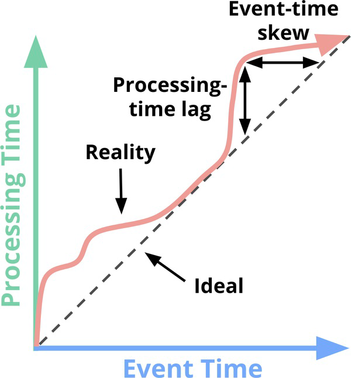

> 时间域映射。X轴表示系统中事件时间的完整性；即，事件时间X之前的所有数据都已被观察到。Y轴表示处理时间的进展；即，数据处理系统执行时所观察到的正常时钟时间。

图中两种时间域内的偏差：

1. **处理延迟**：理想线和红线之间的垂直距离表示处理时间领域中的滞后。这个距离告诉您在给定时间发生的事件和它们被处理的时间之间观察到了多少延迟（以处理时间为单位）。这可能是两种偏差中更自然和直观的一种。
2. **正在处理的事件的延迟**：理想线和红线之间的水平距离表示管道中事件时间的偏差量。它告诉您在该时刻管道在事件时间上与理想情况相比有多大的滞后。

实际上，在任何给定时间点上，**处理时间的滞后和事件时间的偏差是相同的，它们只是看待同一事物的两种方式。**

由于事件时间和处理时间之间的映射不是静态的，因此在分析数据时不能仅考虑数据被处理的时间点，尤其是在关心事件时间的情况下。

许多旨在处理无限数据的系统通常使用**窗口化**的概念来应对无限数据集，但要确保正确性和在事件时间的上下文中分析数据，不能使用处理时间来定义这些时间窗口，因为处理时间和事件时间之间没有一致的关联，这可能导致数据被错误地分配到不正确的处理时间窗口中，从而损害数据处理的正确性。

按事件时间进行窗口化时，情况并不那么乐观。在无限数据的情况下，混乱和可变的偏差会对事件时间窗口的完整性造成问题：在处理时间和事件时间之间缺乏可预测的映射，那么如何确定您已经观察到了给定事件时间 X 的所有数据？

今天的大多数数据处理系统都依赖于**某种完整性的概念**。

我们应该设计工具，自动应对这些复杂数据带来的不确定性。**完整性的概念应该成为特定和适当用例的便捷优化，而不是所有用例的语义必要性。**

## 常见的数据处理模式

使用经典的批处理引擎进行有界数据处理：

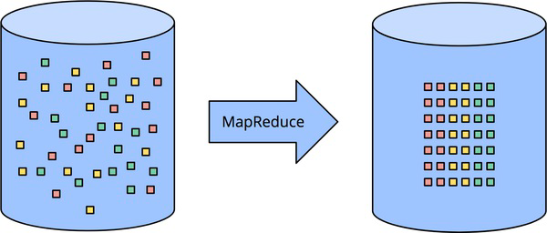

### 处理无界数据的批处理方法

基本方法：将无界数据切成有界数据处理

#### 固定窗口的数据处理方法

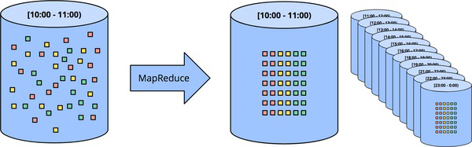

* 使用批处理引擎处理无界数据集的最常见方式是**将输入数据分成固定大小的窗口**，然后将每个窗口作为一个独立的有界数据源进行处理。
* 通常，这种方法需要处理**完整性问题**，因为事件的到达可能会受到网络分区、全局收集以及事件来自移动设备等因素的影响。
* 可能需要采取一些**缓解措施**，例如延迟处理或在数据迟到时重新处理整个窗口的批次。

#### 会话

**会话通常被定义为一段活动期间（例如，对于特定用户），其结束被不活动时间间隔所终止。**

* 当使用典型的批处理引擎计算会话时，经常会出现会话被分割到多个批处理作业中的情况，如图1-4中的红线所示。
* 为了减少这种分割，可以**增加批处理作业的大小**，但这会以增加处理延迟为代价。
* 另一种选择是添加额外的逻辑来**从之前的运行中重新组合会话**，但这会增加处理过程的复杂性。

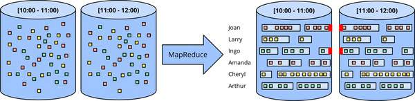

> 图1-4。使用经典批处理引擎通过特定的固定窗口将无界数据处理为会话。无界数据集首先被收集成有界数据的有限固定大小窗口，然后通过连续运行经典批处理引擎将其细分为动态会话窗口。

### 无界数据：流处理

流处理系统是专门为处理无界数据构建的。

现实世界中，不仅要处理无界数据，还要处理以下类型的数据：

1. 相对于事件时间高度无序，这意味着如果你想要在事件发生的上下文中分析数据，就需要在管道中进行一定的基于时间的洗牌（排序）。
2. 具有不同的事件时间偏移，这意味着你不能仅仅假设你会在某个恒定的时间间隔内始终看到给定事件时间X的大部分数据。

要处理这些数据，有四种方法：

* **Time-Agnostic（时间不敏感）**： 这个策略不考虑事件时间，将数据按它们到达的顺序处理。这对于那些不依赖于事件时间的分析和处理任务适用。

* **Approximation（近似处理）**： 这种方法将数据进行近似处理，以减少计算复杂性和延迟。近似方法可以用于某些分析任务，其中精确性不是首要考虑因素。

* **Windowing by Processing Time（基于处理时间的窗口）**： 这个策略将数据分成固定大小的时间窗口，然后处理每个窗口中的数据。这种方法以处理时间为基准，可能不适用于需要考虑事件时间的任务。

* **Windowing by Event Time（基于事件时间的窗口）**： 这种策略将数据分成基于事件时间的窗口，以便考虑事件发生的时间顺序。这对于需要准确考虑事件时间的分析和处理任务非常重要。

#### 时间不敏感

适用于那些不依赖事件发生的时间或时间顺序的情况，数据的到达驱动所有相关的逻辑，时间对数据处理没有特殊要求。

大多数流式系统天生支持。

##### 过滤

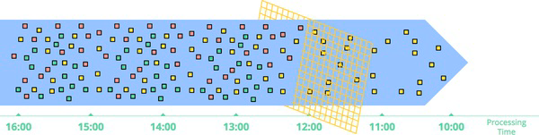

> 图1-5. 对无界数据进行筛选。包含不同类型的数据集（从左到右流动）被筛选成一个包含单一类型的数据集。

##### 内连接

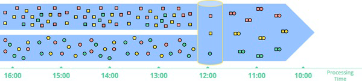

> 图1-6. 在无界数据上执行内部连接。连接在观察到来自两个源的匹配元素时生成。

拿到连接的一侧之后，并不能确定另一侧是否到达。所以需要引入超时的概念。引入时间元素，本质上就是一种窗口化 。

#### 近似算法

比如，近似 Top-N、流式 k-means 等等。

优点：开销低，专门用于无界数据。
缺点：数量有限，算法本身通常比较复杂，近似性限制了实用性。

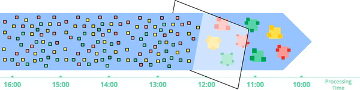

> 图1-7. 计算无界数据的近似值。数据通过复杂的算法处理，产生的输出数据或多或少地类似于期望的结果。

简单，不是我们的重点。

#### 窗口化

**窗口化**简单来说，就是**将数据源（无论是无界的还是有界的）按照时间边界划分成有限的块以供处理**。下面是三种不同的窗口处理模式：

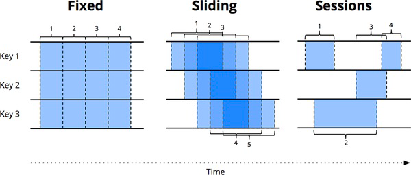

> 图1-8. 窗口策略。每个示例都针对三个不同的键进行展示，突显了对齐窗口（适用于所有数据）和非对齐窗口（适用于数据子集）之间的区别。

* **固定窗口（也称滚动窗口）**
我们之前讨论过固定窗口。**固定窗口将时间分割成具有固定时间长度的段。**通常情况下（如图1-9所示），固定窗口的段均匀应用于整个数据集，这是对齐窗口的示例。在某些情况下，为了在不同数据子集（例如，按键）上更均匀地分布窗口完成负载，可以对不同数据子集应用不同的窗口，这是非对齐窗口的示例，因为它们在数据上变化。

* **滑动窗口（也称为跳跃窗口）**
滑动窗口是**固定窗口的一种泛化，由固定长度和固定周期定义**。如果周期小于长度，窗口会重叠。如果周期等于长度，你将得到固定窗口。如果周期大于长度，你将得到一种奇怪的采样窗口，它只在一段时间内查看数据的子集。与固定窗口一样，滑动窗口通常是对齐的，尽管在某些用例中，它们可以是非对齐的性能优化。需要注意的是，图1-8中的滑动窗口是以这种方式绘制的，以便呈现滑动的视觉效果；实际上，所有五个窗口都会应用于整个数据集。

* **会话**
会话是动态窗口的一个示例，**由一系列事件组成，这些事件以大于某个超时时间的不活动间隙终止。** 会话通常用于分析用户随时间的行为，通过将一系列在时间上相关的事件（例如，一系列连续观看的视频）分组在一起。会话很有趣，因为它们的长度无法事先定义；它们依赖于实际涉及的数据。它们也是非对齐窗口的经典示例，因为会话在不同数据子集（例如，不同用户）中几乎永远不会相同。

接下来看下在**处理时间**和**事件时间**两个时间域上的**窗口化**。

##### 按处理时间窗口化

缓冲数据到窗口中，持续一定的时间。

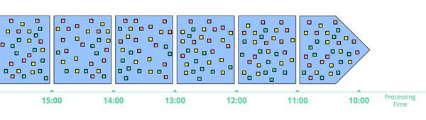

> 图1-9. 按处理时间划分的固定窗口窗口化。数据根据它们在管道中到达的顺序收集到窗口中。

处理时间窗口具有以下几个优点：

* **简单**：实现非常简单，因为不需要担心数据在时间内的重新排序，只需将数据按到达的顺序缓冲，然后在窗口关闭时将其发送到下游进行处理。

* **完整性判断**：系统可以完美地判断窗口是否完成，因为它完全了解窗口的所有输入是否已经看到，这意味着在处理时间窗口中不需要处理“迟到”的数据。

* **用于实时推断**：处理时间窗口适用于需要实时推断源数据的情况，如监视场景，例如跟踪全球 Web 服务的每秒请求数量。

然而，处理时间窗口的一个主要缺点是，如果数据具有与之相关的事件时间，则这些数据必须按照事件时间的顺序到达，以便处理时间窗口反映事件实际发生的时间。不幸的是，在许多分布式输入源中，事件时间有序的数据并不常见，因此在这些情况下，处理时间窗口可能无法提供有用的分析。此时，事件时间窗口是更好的选择，可以处理无序和具有不同事件时间偏移的数据，以准确反映事件的发生时间。

##### 按事件时间窗口化

事件时间窗口是在需要观察数据源以反映事件实际发生时间的有限时间段时使用的窗口处理方法。它是窗口处理的黄金标准。

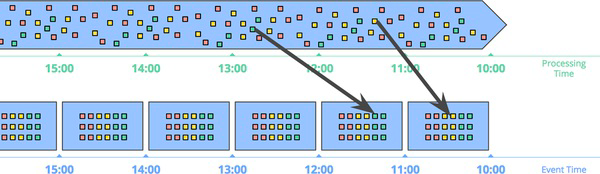

> 图1-10。按事件时间窗口对数据进行窗口处理。数据是根据它们发生的时间被收集到窗口中的。黑色箭头标出了一些示例数据，这些数据到达处理时间窗口与它们所属的事件时间窗口不同。

* 事件时间的**正确性**是使用事件时间窗口的一个好处。
* 使用事件时间窗口处理无界数据源的另一个好处是，你可以**创建动态大小的窗口，比如会话，而无需在生成固定窗口上观察到的任意拆分**，比如：

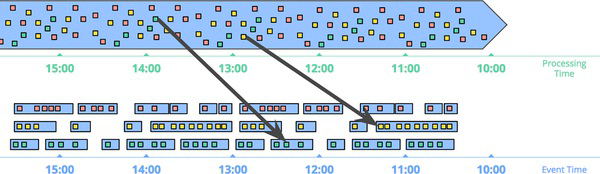

> 图1-11显示了通过事件时间窗口将数据收集到会话窗口中，捕获了根据相应事件发生时间的活动突发。黑色箭头再次指出了将数据放入其正确的事件时间位置所需的时间重排。

强大语义的成本：

1. **缓冲**: 窗口生命周期更长，需要更多的数据缓存。
2. **完整性**: 最好在具体示例的背景下进行探讨，后面会深入研究。

## 总结

在本章中，我们涵盖了大量内容并建立了一些关键概念：

1. 通过定义“**流式**”系统来澄清了术语，将其指代为专门设计用于无界数据的系统，同时引入了描述性术语，如近似/猜测结果，以涵盖“流式”概念下的不同概念。

2. 讨论了大规模数据集的维度：**基数**（有界与无界）和**构成**（表格与流），其中后者将占据本书下半部分的大部分内容。

3. 评估了精心设计的批处理和流式系统的相对能力，提出**流式实际上是批处理的严格子集**，并认为基于流式系统较差于批处理的概念，如Lambda架构，随着流式系统的成熟，注定将被淘汰。

4. 提出了两个高层次概念，流式系统需要这两个概念来赶上并最终超越批处理，这两个概念分别是**正确性**和**关于时间推理工具**。

5. 确立了**事件时间**和**处理时间**之间的重要差异，表征了这些差异在分析数据时造成的困难，并提出了一种转变方法，远离完整性的概念，转向简单地适应数据随时间的变化。

6. 着眼于今天常见的有界和无界数据的主要数据处理方法，通过批处理和流处理引擎，大致将无界数据处理方法分为：**时间不敏感**、**近似**、**按处理时间窗口**以及**按事件时间窗口**。

接下来，我们将深入探讨 Beam 模型的细节，审视其概念框架，了解如何沿四个轴线（什么、在哪里、何时和如何）分解数据处理，并通过具体示例来说明事件时间、处理时间以及新概念，如水印。